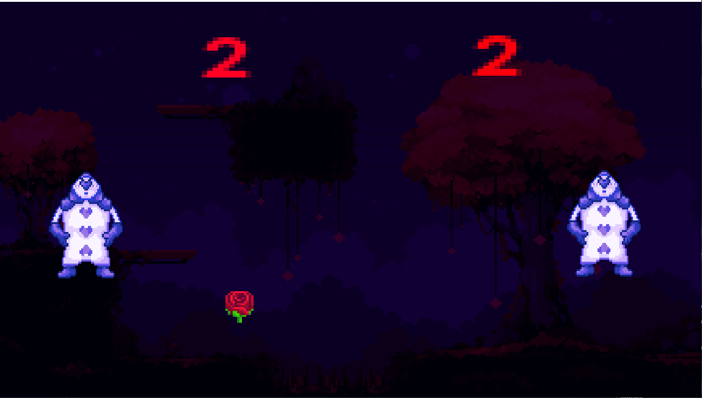

Jogo desenvolvido para a disciplina de *Jogos Digitais*, com o objetivo de aprender a manusear a engine Godot.

O jogo permite salvar a pontuação dos jogadores. A pontuação é salva em um arquivo de dados (savegame.data) e é carregada ao iniciar o jogo.

### Controles
Jogador 1: W e S para mover a paleta para cima e para baixo.

Jogador 2: I e K para mover a paleta para cima e para baixo.

